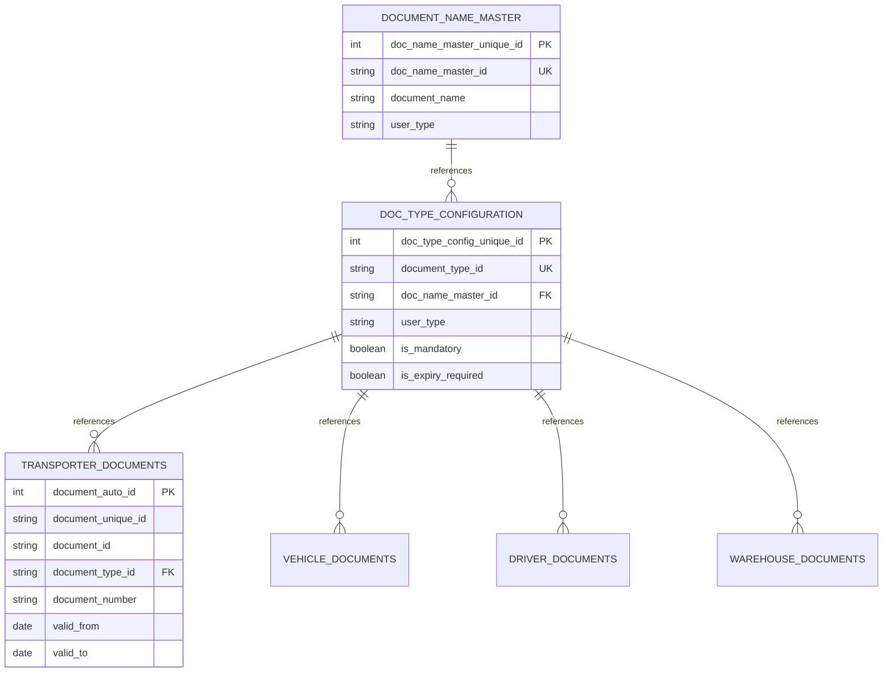

# 📘 Document Upload Guidelines

> **Updated for TMS-Dev-2 - Node.js + Express + MySQL Architecture**

This document provides implementation and validation standards for the **Document Upload Functionality** within the TMS (Transport Management System) application.  
It defines the **database structure**, **validation rules**, **data consistency requirements**, and **error handling** guidelines to ensure robust and reliable document management.

---

## 🏗️ TMS Application Architecture

### Technology Stack
- **Frontend**: React 19.1.1 + Vite 7.1.7 + TailwindCSS 4.1.14
- **Backend**: Node.js + Express 5.1.0
- **Database**: MySQL 8.0 with Knex.js 3.1.0 ORM
- **File Handling**: Multer 2.0.2 for uploads
- **Authentication**: JWT 9.0.2

### Document Storage Strategy
**Current Implementation**: Local file system storage (not database BLOB)
- Documents stored in `/uploads` directory structure
- Database stores file metadata and paths only
- File naming convention: `{documentType}_{timestamp}_{originalName}`

**Future Enhancement**: AWS S3 integration for production

---

## 🧩 Database Table Structure

The TMS application uses the following tables for document management:

### 1. Entity-Specific Document Tables

#### A. `transporter_documents`
Stores documents for transporter entities.

| Column Name | Type | Description |
|-------------|------|-------------|
| `document_auto_id` | INT (PK) | Auto-incrementing primary key |
| `document_unique_id` | VARCHAR(20) | Business unique identifier (not null) |
| `document_id` | VARCHAR(20) | Document identifier linking to transporter (not null) |
| `document_type_id` | VARCHAR(10) | References `doc_type_configuration` |
| `document_number` | VARCHAR(100) | Document number (e.g., PAN: ABCDE1234F) |
| `reference_number` | VARCHAR(100) | Additional reference number |
| `country` | VARCHAR(100) | Document issuing country |
| `valid_from` | DATE | Document validity start date |
| `valid_to` | DATE | Document validity end date |
| `active` | BOOLEAN | Document active status (default: true) |
| `user_type` | VARCHAR(50) | User category (e.g., Transporter) |
| `created_at` | DATETIME | Record creation timestamp |
| `created_on` | DATETIME | Alternative creation timestamp |
| `created_by` | VARCHAR(10) | User ID who created record |
| `updated_at` | DATETIME | Last update timestamp |
| `updated_on` | DATETIME | Alternative update timestamp |
| `updated_by` | VARCHAR(10) | User ID who last updated |
| `status` | VARCHAR(10) | Record status (default: ACTIVE) |

**Indexes**: 
- `idx_trans_docs_unique_id` on `document_unique_id`
- `idx_trans_docs_id` on `document_id`
- `idx_trans_docs_type_id` on `document_type_id`
- `idx_trans_docs_number` on `document_number`

#### B. `vehicle_documents`
Similar structure for vehicle entities (same columns, different table name).

#### C. `driver_documents`
Similar structure for driver entities (same columns, different table name).

#### D. `warehouse_documents`
Similar structure for warehouse entities (same columns, different table name).

### 2. `doc_type_configuration`
Master configuration for document types across all entities.

| Column Name | Type | Description |
|-------------|------|-------------|
| `doc_type_config_unique_id` | INT (PK) | Auto-incrementing primary key |
| `document_type_id` | VARCHAR(20) | Business unique identifier (UNIQUE, NOT NULL) |
| `doc_name_master_id` | VARCHAR(20) | References `document_name_master` |
| `user_type` | VARCHAR(50) | Applicable user category (Transporter, Driver, Vehicle, etc.) |
| `service_area_country` | VARCHAR(100) | Country/region for document applicability |
| `is_mandatory` | BOOLEAN | Whether document is mandatory (default: false) |
| `is_expiry_required` | BOOLEAN | Whether expiry date validation required (default: false) |
| `is_verification_required` | BOOLEAN | Whether document needs verification (default: false) |
| `created_at` | DATETIME | Record creation timestamp |
| `created_on` | DATETIME | Alternative creation timestamp |
| `created_by` | VARCHAR(10) | User ID who created record |
| `updated_at` | DATETIME | Last update timestamp |
| `updated_on` | DATETIME | Alternative update timestamp |
| `updated_by` | VARCHAR(10) | User ID who last updated |
| `status` | VARCHAR(10) | Record status (default: ACTIVE) |

**Indexes**: 
- `document_type_id` (unique)
- `user_type`
- `status`

### 3. `document_name_master`
Master list of document names across the system.

| Column Name | Type | Description |
|-------------|------|-------------|
| `doc_name_master_unique_id` | INT (PK) | Auto-incrementing primary key |
| `doc_name_master_id` | VARCHAR(20) | Business unique identifier (UNIQUE, NOT NULL) |
| `document_name` | VARCHAR(200) | Human-readable document name (e.g., "PAN/TIN", "GST Certificate") |
| `user_type` | VARCHAR(50) | Applicable user category |
| `created_at` | DATETIME | Record creation timestamp |
| `created_on` | DATETIME | Alternative creation timestamp |
| `created_by` | VARCHAR(10) | User ID who created record |
| `updated_at` | DATETIME | Last update timestamp |
| `updated_on` | DATETIME | Alternative update timestamp |
| `updated_by` | VARCHAR(10) | User ID who last updated |
| `status` | VARCHAR(10) | Record status (default: ACTIVE) |

**Indexes**: 
- `doc_name_master_id` (unique)
- `user_type`
- `status`

---

## 📐 Table Relationships

---

## ✅ Functional Guidelines

### 1. File Upload Process