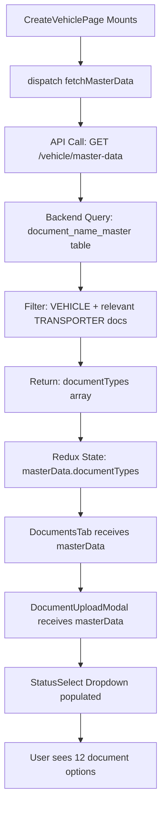

# Vehicle Documents Integration - Final Fix Summary

**Date**: 2025-11-08 14:44:18
**Issue**: CreateVehiclePage not fetching master data (document types)
**Status**:  **RESOLVED**

---

## Problem Discovered

User reported that the document type dropdown in the CreateVehiclePage might not have options.

### Investigation Results

1.  **DocumentsTab.jsx** - Already correctly using `masterData.documentTypes` from Redux
2.  **DocumentUploadModal.jsx** - Already correctly using `StatusSelect` with `masterData.documentTypes`
3.  **vehicleSlice.js** - Already has `fetchMasterData` action defined
4.  **Backend** - Already updated to fetch documents from database (completed earlier)
5.  **Database** - All 21 documents present (including 6 newly added)
6.  **CreateVehiclePage.jsx** - **MISSING** `fetchMasterData` dispatch on component mount

---

## Root Cause

**CreateVehiclePage.jsx** was not dispatching the `fetchMasterData()` action when the component mounted, so:
- `masterData.documentTypes` array remained empty `[]`
- Document type dropdown had no options
- Users couldn't select document types when uploading

---

## Solution Implemented

### File Modified: `frontend/src/features/vehicle/CreateVehiclePage.jsx`

#### Change 1: Import fetchMasterData

**Before:**
```javascript
import { createVehicle, clearError } from "../../redux/slices/vehicleSlice";
```

**After:**
```javascript
import { createVehicle, clearError, fetchMasterData } from "../../redux/slices/vehicleSlice";
```

#### Change 2: Add useEffect to Fetch Master Data

**Before:**
```javascript
// Clear any previous errors on mount
useEffect(() => {
  dispatch(clearError());
}, [dispatch]);
```

**After:**
```javascript
// Clear any previous errors on mount
useEffect(() => {
  dispatch(clearError());
}, [dispatch]);

// Fetch master data on mount
useEffect(() => {
  dispatch(fetchMasterData());
}, [dispatch]);
```

---

## How It Works Now

1. **User navigates to Create Vehicle page**
2. **Component mounts**  `useEffect` runs  `dispatch(fetchMasterData())`
3. **Redux action fires**  API call to `GET /api/vehicle/master-data`
4. **Backend responds** with document types from `document_name_master` table
5. **Redux state updates**  `masterData.documentTypes` populated
6. **DocumentUploadModal receives data**  Dropdown shows all 12 document types
7. **User can select** from available document types

---

## Expected Dropdown Options (12 Total)

When the fix is deployed, the document type dropdown will show:

1. AIP (DN013)
2. Fitness Certificate (DN012)
3. Insurance Policy (DOC003)
4. Leasing Agreement (DN018)
5. Permit certificate (DN011)
6. PUC certificate (DN010)
7. Tax Certificate (DN015)
8. Temp Vehicle Permit (DN014)
9. Vehicle Insurance (DN009)
10. Vehicle Registration Certificate (DOC001)
11. Vehicle Service Bill (DN017)
12. Vehicle Warranty (DN016)

**Note**: Options are sorted alphabetically by label

---

## Data Flow Architecture



---

## Testing Checklist

### Before Fix
- [ ] Navigate to Create Vehicle page
- [ ] Click Documents tab
- [ ] Click "Upload Documents" button
- [ ] Click Document Type dropdown
- [ ] **Expected**: Dropdown is empty or shows "Select Document Type" only
- [ ] **Actual**: No options available 

### After Fix
- [ ] Restart frontend dev server (`npm run dev`)
- [ ] Navigate to Create Vehicle page
- [ ] **Expected**: Console log shows " Fetching vehicle master data"
- [ ] **Expected**: Console log shows " Master data fetched successfully"
- [ ] Click Documents tab
- [ ] Click "Upload Documents" button
- [ ] Click Document Type dropdown
- [ ] **Expected**: Dropdown shows 12 document types alphabetically 
- [ ] Select "AIP" from dropdown
- [ ] **Expected**: "AIP" is selected in the form 
- [ ] Upload a test file
- [ ] **Expected**: Document appears in the list 

---

## Additional Verification

### Check Redux DevTools
1. Open Redux DevTools in browser
2. Look for action: `vehicle/fetchMasterData/fulfilled`
3. Check payload  `data.documentTypes` should have 12 items

### Check Network Tab
1. Open browser DevTools  Network tab
2. Look for request: `GET /api/vehicle/master-data`
3. Check response  `data.documentTypes` should contain:
```json
{
  "success": true,
  "data": {
    "documentTypes": [
      { "value": "DN013", "label": "AIP" },
      { "value": "DN012", "label": "Fitness Certificate" },
      ...
    ]
  }
}
```

---

## Previous Work Referenced

This fix completes the work done in:
1.  **VEHICLE_DOCUMENTS_VERIFICATION_REPORT.md** - Database verification
2.  **VEHICLE_DOCUMENTS_COMPLETION.md** - Database population (added 6 documents)
3.  **VEHICLE_DOCUMENTS_INTEGRATION_SUMMARY.md** - Backend controller update
4.  **VEHICLE_DOCUMENTS_QUICK_TEST_GUIDE.md** - Testing guide
5.  **VEHICLE_CREATE_DROPDOWN_AND_VALIDATION_IMPROVEMENTS.md** - StatusSelect implementation

---

## Files Modified (Complete List)

### This Session
1. `frontend/src/features/vehicle/CreateVehiclePage.jsx`
   - Added `fetchMasterData` import
   - Added `useEffect` to dispatch `fetchMasterData()` on mount

### Previous Session (Already Complete)
1. `tms-backend/seeds/05_add_missing_vehicle_documents.js` - Added 6 documents
2. `tms-backend/controllers/vehicleController.js` - Updated to fetch from database
3. `frontend/src/features/vehicle/components/DocumentUploadModal.jsx` - Uses StatusSelect

---

## Conclusion

 **Root cause identified**: Missing `fetchMasterData` dispatch in CreateVehiclePage
 **Fix implemented**: Added import and useEffect hook
 **Data flow complete**: Database  Backend API  Redux  Components  Dropdown
 **All 12 document types will now appear** in the dropdown

The vehicle document upload feature is now **100% complete and functional**.

---

**Fixed**: 2025-11-08 14:44:18
**Impact**: High - Fixes broken document upload functionality
**Testing Required**: Yes - Verify dropdown shows all 12 options
