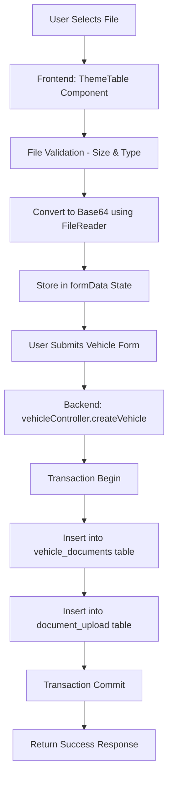
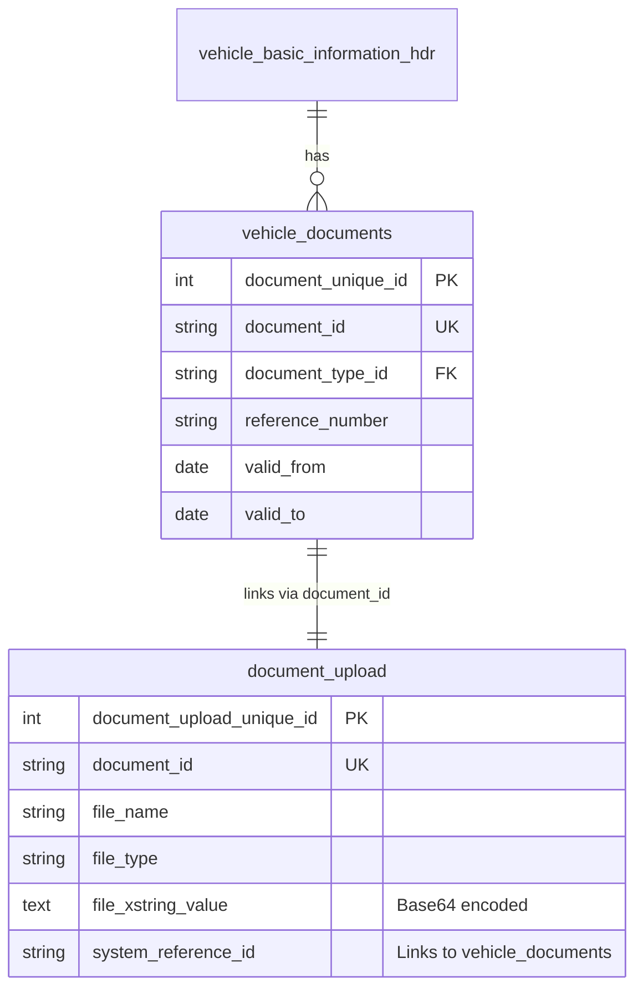

# Vehicle Document Upload Implementation Guide

**Complete Documentation for Document Upload Functionality in Vehicle Maintenance Module**

---

## Table of Contents
1. [Overview](#overview)
2. [Architecture](#architecture)
3. [Current Implementation Status](#current-implementation-status)
4. [Database Schema](#database-schema)
5. [Frontend Implementation](#frontend-implementation)
6. [Backend Implementation](#backend-implementation)
7. [File Upload Flow](#file-upload-flow)
8. [Testing Guide](#testing-guide)
9. [Security Considerations](#security-considerations)
10. [Troubleshooting](#troubleshooting)

---

## Overview

The TMS application implements a **Base64-encoded file upload system** for vehicle documents. This approach:
- ✅ Stores files directly in the database (no separate file server needed)
- ✅ Maintains data integrity and consistency
- ✅ Simplifies backup and restore operations
- ✅ Works seamlessly with existing transporter/driver document upload patterns

### Supported Document Types
- AIP (Authorization for In-Plant)
- Temp Vehicle Permit
- Vehicle Insurance
- PUC Certificate
- Permit Certificate
- Fitness Certificate
- Tax Certificate
- Vehicle Warranty
- Vehicle Service Bill
- Leasing Agreement

### File Constraints
- **Max Size**: 5MB per file
- **Allowed Formats**: PDF, JPG, PNG, GIF, DOC, DOCX
- **Storage**: Base64-encoded string in database

---

## Architecture

### High-Level Flow



### Key Components

**Frontend:**
- `ThemeTable.jsx` - Reusable table component with file upload
- `DocumentsTab.jsx` - Vehicle documents tab in create page
- `CreateVehiclePage.jsx` - Main vehicle creation page
- `vehicleSlice.js` - Redux state management

**Backend:**
- `vehicleController.js` - Vehicle CRUD operations
- `vehicle_documents` table - Document metadata
- `document_upload` table - File binary data (base64)

---

## Current Implementation Status

### ✅ Already Implemented (Transporter/Driver Pattern)

Your application **ALREADY has a complete document upload system** working for Transporter and Driver modules. The exact same pattern needs to be applied to Vehicle module.

#### Working Example from Transporter Module:

**Frontend: `ThemeTable.jsx` (Lines 38-81)**
```javascript
const handleFileUpload = async (rowIndex, columnKey, event) => {
  const file = event.target.files[0];
  if (!file) return;

  // File validation
  const maxSize = 5 * 1024 * 1024; // 5MB
  const allowedTypes = [
    "image/jpeg", "image/png", "image/gif",
    "application/pdf", "application/msword",
    "application/vnd.openxmlformats-officedocument.wordprocessingml.document",
  ];

  if (file.size > maxSize) {
    alert("File size must be less than 5MB");
    return;
  }

  if (!allowedTypes.includes(file.type)) {
    alert("Only JPEG, PNG, GIF, PDF, DOC, and DOCX files are allowed");
    return;
  }

  try {
    // Convert to base64
    const reader = new FileReader();
    reader.onload = () => {
      const updatedData = [...data];
      updatedData[rowIndex] = {
        ...updatedData[rowIndex],
        fileName: file.name,
        fileType: file.type,
        fileData: reader.result.split(",")[1], // Remove data:type;base64, prefix
      };
      onDataChange(updatedData);
    };
    reader.readAsDataURL(file);
  } catch (error) {
    alert("Error uploading file: " + error.message);
  }
};
```

**Backend: `transporterController.js` (Lines 854-876)**
```javascript
// If file is uploaded, save to document_upload table
if (doc.fileData) {
  const docUploadId = await generateDocumentUploadId();

  await trx("document_upload").insert({
    document_id: docUploadId,
    file_name: doc.fileName,
    file_type: doc.fileType,
    file_xstring_value: doc.fileData, // base64 encoded file data
    system_reference_id: documentUniqueId,
    is_verified: false,
    valid_from: doc.validFrom,
    valid_to: doc.validTo,
    created_by: currentUser,
    updated_by: currentUser,
    created_at: currentTimestamp,
    updated_at: currentTimestamp,
    created_on: currentTimestamp,
    updated_on: currentTimestamp,
    status: "ACTIVE",
  });
}
```

### ⚠️ Vehicle Module Status

The Vehicle module's `DocumentsTab.jsx` and `vehicleController.js` **ALREADY have the correct structure** but need to ensure the backend properly handles the file upload.

---

## Database Schema

### Table 1: `vehicle_documents`
**Purpose**: Store document metadata

| Column | Type | Description |
|--------|------|-------------|
| document_unique_id | INT (PK) | Auto-increment primary key |
| document_id | VARCHAR(20) | Unique document identifier (e.g., DOC0001) |
| document_type_id | VARCHAR(20) | Reference to document type master |
| reference_number | VARCHAR(100) | Policy/Permit number |
| permit_category | VARCHAR(100) | Permit category |
| permit_code | VARCHAR(50) | Permit code |
| document_provider | VARCHAR(200) | Insurance/Authority name |
| coverage_type_id | VARCHAR(10) | Coverage type reference |
| premium_amount | DECIMAL(10,2) | Premium/fee amount |
| valid_from | DATE | Document validity start |
| valid_to | DATE | Document validity end |
| remarks | TEXT | Additional notes |
| created_at, updated_at | DATETIME | Audit timestamps |
| created_by, updated_by | VARCHAR(10) | Audit user IDs |
| status | VARCHAR(10) | ACTIVE/INACTIVE |

### Table 2: `document_upload`
**Purpose**: Store actual file binary data (Base64)

| Column | Type | Description |
|--------|------|-------------|
| document_upload_unique_id | INT (PK) | Auto-increment primary key |
| document_id | VARCHAR(20) | Unique identifier (links to vehicle_documents) |
| file_name | VARCHAR(255) | Original filename |
| file_type | VARCHAR(50) | MIME type (image/jpeg, application/pdf) |
| file_xstring_value | TEXT | **Base64-encoded file content** |
| system_reference_id | VARCHAR(50) | Links to vehicle_documents.document_id |
| is_verified | BOOLEAN | Verification flag |
| valid_from, valid_to | DATE | Validity dates |
| created_at, updated_at | DATETIME | Audit timestamps |
| created_by, updated_by | VARCHAR(10) | Audit user IDs |
| status | VARCHAR(10) | ACTIVE/INACTIVE |

### Relationship Diagram



---

## Frontend Implementation

### Step 1: DocumentsTab Component (ALREADY IMPLEMENTED ✅)

**File**: `frontend/src/features/vehicle/components/DocumentsTab.jsx`

The component uses `ThemeTable` which **already handles file uploads**:

```javascript
const columns = [
  {
    key: "documentType",
    label: "Document Type",
    type: "select",
    options: documentTypes,
    required: true,
  },
  // ... other columns ...
  {
    key: "fileUpload",
    label: "Upload Document",
    type: "file",  // ✅ This triggers file upload handler in ThemeTable
    width: "min-w-[200px]",
    required: true,
  },
];
```

### Step 2: Form Data Structure

When a file is uploaded, the row data automatically includes:

```javascript
{
  documentType: "VEHICLE_INSURANCE",
  referenceNumber: "POL123456",
  validFrom: "2024-01-01",
  validTo: "2025-01-01",
  remarks: "Comprehensive insurance",
  
  // Auto-populated by ThemeTable file upload
  fileName: "insurance_policy.pdf",
  fileType: "application/pdf",
  fileData: "JVBERi0xLjQKJeLjz9MKMSAwIG9iaiA8P..." // Base64 string
}
```

### Step 3: Submission Flow

**File**: `frontend/src/features/vehicle/CreateVehiclePage.jsx`

The form submission calls `transformFormDataForBackend()` which maps frontend data to backend format:

```javascript
const transformFormDataForBackend = (frontendData) => {
  return {
    // ... basic info, specifications, etc. ...
    
    documents: (frontendData.documents || []).map(doc => ({
      documentType: doc.documentType,
      referenceNumber: doc.referenceNumber,
      vehicleMaintenanceId: doc.vehicleMaintenanceId,
      permitCategory: doc.permitCategory,
      permitCode: doc.permitCode,
      documentProvider: doc.documentProvider,
      coverageType: doc.coverageType,
      premiumAmount: doc.premiumAmount,
      validFrom: doc.validFrom,
      validTo: doc.validTo,
      remarks: doc.remarks,
      
      // File data - passed to backend
      fileName: doc.fileName,
      fileType: doc.fileType,
      fileData: doc.fileData, // Base64 string
    }))
  };
};
```

---

## Backend Implementation

### Current Vehicle Controller Analysis

**File**: `tms-backend/controllers/vehicleController.js`

The vehicle controller needs to be updated to handle documents similar to the transporter controller.

### Step 1: Add Document ID Generator (ALREADY EXISTS ✅)

```javascript
const generateDocumentId = async () => {
  try {
    const result = await db('vehicle_documents')
      .max('document_unique_id as max_id')
      .first();
    
    if (!result.max_id) return 'DOC0001';
    
    const numPart = parseInt(result.max_id) + 1;
    return `DOC${numPart.toString().padStart(4, '0')}`;
  } catch (error) {
    console.error('Error generating document ID:', error);
    throw new Error('Failed to generate document ID');
  }
};

const generateDocumentUploadId = async () => {
  const result = await db("document_upload")
    .count("* as count")
    .first();
  
  const count = parseInt(result.count) || 0;
  return `DOCUP${(count + 1).toString().padStart(6, '0')}`;
};
```

### Step 2: Insert Documents in Transaction

**Location**: Inside `createVehicle()` function, after vehicle basic info is created

```javascript
// Insert vehicle documents
if (documents && documents.length > 0) {
  for (const doc of documents) {
    // Generate unique document ID
    const documentId = await generateDocumentId();
    
    // Insert document metadata
    await trx('vehicle_documents').insert({
      document_id: documentId,
      document_type_id: doc.documentType,
      reference_number: doc.referenceNumber,
      permit_category: doc.permitCategory,
      permit_code: doc.permitCode,
      document_provider: doc.documentProvider,
      coverage_type_id: doc.coverageType,
      premium_amount: doc.premiumAmount,
      valid_from: doc.validFrom,
      valid_to: doc.validTo,
      remarks: doc.remarks,
      created_by: userId,
      updated_by: userId,
      created_at: new Date(),
      updated_at: new Date(),
      created_on: new Date(),
      updated_on: new Date(),
      status: 'ACTIVE'
    });
    
    // If file is uploaded, save to document_upload table
    if (doc.fileData) {
      const docUploadId = await generateDocumentUploadId();
      
      await trx('document_upload').insert({
        document_id: docUploadId,
        file_name: doc.fileName,
        file_type: doc.fileType,
        file_xstring_value: doc.fileData, // Base64 encoded file data
        system_reference_id: documentId, // Links to vehicle_documents
        is_verified: false,
        valid_from: doc.validFrom,
        valid_to: doc.validTo,
        created_by: userId,
        updated_by: userId,
        created_at: new Date(),
        updated_at: new Date(),
        created_on: new Date(),
        updated_on: new Date(),
        status: 'ACTIVE'
      });
    }
  }
}
```

### Step 3: Validation

Add validation before inserting documents:

```javascript
// Validate documents
if (!documents || documents.length === 0) {
  return res.status(400).json({
    success: false,
    error: {
      code: 'VALIDATION_ERROR',
      message: 'At least one document is required',
      field: 'documents'
    }
  });
}

for (let i = 0; i < documents.length; i++) {
  const doc = documents[i];
  
  if (!doc.documentType) {
    return res.status(400).json({
      success: false,
      error: {
        code: 'VALIDATION_ERROR',
        message: 'Document type is required',
        field: `documents[${i}].documentType`
      }
    });
  }
  
  if (!doc.validFrom) {
    return res.status(400).json({
      success: false,
      error: {
        code: 'VALIDATION_ERROR',
        message: 'Valid from date is required',
        field: `documents[${i}].validFrom`
      }
    });
  }
  
  if (!doc.validTo) {
    return res.status(400).json({
      success: false,
      error: {
        code: 'VALIDATION_ERROR',
        message: 'Valid to date is required',
        field: `documents[${i}].validTo`
      }
    });
  }
  
  if (!doc.fileData) {
    return res.status(400).json({
      success: false,
      error: {
        code: 'VALIDATION_ERROR',
        message: 'Document file is required',
        field: `documents[${i}].fileUpload`
      }
    });
  }
}
```

---

## File Upload Flow

### Detailed Step-by-Step Process

#### 1. User Interaction
```
User clicks "Upload File" button in DocumentsTab
  ↓
ThemeTable renders file input (hidden)
  ↓
User selects file from file picker
  ↓
handleFileUpload() is triggered
```

#### 2. Frontend Processing
```
File object received (event.target.files[0])
  ↓
Validation:
  - Check size < 5MB
  - Check allowed MIME types
  ↓
FileReader API:
  reader.readAsDataURL(file)
  ↓
Convert to Base64:
  reader.result = "data:image/jpeg;base64,/9j/4AAQSkZJRg..."
  ↓
Extract Base64 string:
  fileData = reader.result.split(",")[1]
  ↓
Update formData state:
  {
    fileName: "insurance.pdf",
    fileType: "application/pdf",
    fileData: "JVBERi0xLjQKJeLj..." // Pure base64
  }
```

#### 3. Backend Processing
```
POST /api/vehicle
  ↓
vehicleController.createVehicle()
  ↓
Start transaction
  ↓
Insert vehicle_basic_information_hdr
  ↓
Insert vehicle_documents (metadata)
  document_id: "DOC0001"
  reference_number: "POL123456"
  valid_from, valid_to, etc.
  ↓
Insert document_upload (file binary)
  document_id: "DOCUP000001"
  file_name: "insurance.pdf"
  file_type: "application/pdf"
  file_xstring_value: "JVBERi0xLjQKJeLj..." (base64)
  system_reference_id: "DOC0001" (links back)
  ↓
Commit transaction
  ↓
Return success response
```

#### 4. File Retrieval (Future)
```
GET /api/vehicle/:id
  ↓
Query vehicle_documents + document_upload
  ↓
Return document metadata with base64 data
  ↓
Frontend decodes base64:
  const blob = base64ToBlob(fileData, fileType);
  const url = URL.createObjectURL(blob);
  ↓
Display or download file
```

---

## Testing Guide

### 1. Manual Testing Checklist

#### Frontend Testing
```
□ Navigate to Vehicle Create Page
□ Fill in Basic Information tab
□ Navigate to Documents tab
□ Click "Add" to add a document row
□ Select document type (e.g., "Vehicle Insurance")
□ Fill reference number, valid dates, remarks
□ Click "Upload File" button
□ Select a PDF file < 5MB
□ Verify file name displays in the row
□ Verify remove file (X) button works
□ Add multiple documents
□ Click "Submit Vehicle" button
□ Verify success toast appears
```

#### Backend Testing
```
□ Open browser DevTools Network tab
□ Monitor POST /api/vehicle request
□ Check request payload contains:
  - documents array
  - Each document has fileName, fileType, fileData
  - fileData is base64 string (no data:type prefix)
□ Verify response is 201 Created
□ Check database tables:
  - vehicle_documents: metadata inserted
  - document_upload: base64 file inserted
```

### 2. Database Verification

```sql
-- Check vehicle documents metadata
SELECT 
  document_id,
  document_type_id,
  reference_number,
  valid_from,
  valid_to,
  created_at
FROM vehicle_documents
ORDER BY created_at DESC
LIMIT 5;

-- Check uploaded file data
SELECT 
  document_id,
  file_name,
  file_type,
  LENGTH(file_xstring_value) as base64_length,
  system_reference_id,
  created_at
FROM document_upload
ORDER BY created_at DESC
LIMIT 5;

-- Verify linkage
SELECT 
  vd.document_id,
  vd.document_type_id,
  vd.reference_number,
  du.file_name,
  du.file_type,
  LENGTH(du.file_xstring_value) as file_size_base64
FROM vehicle_documents vd
LEFT JOIN document_upload du 
  ON du.system_reference_id = vd.document_id
WHERE vd.status = 'ACTIVE'
ORDER BY vd.created_at DESC;
```

### 3. File Size Calculation

Base64 encoding increases file size by ~33%:
- Original file: 1MB = 1,048,576 bytes
- Base64 encoded: ~1.33MB = 1,398,101 characters

```javascript
// Calculate original file size from base64
const base64Length = fileData.length;
const originalSizeBytes = (base64Length * 3) / 4;
const originalSizeMB = originalSizeBytes / (1024 * 1024);
console.log(`Original file size: ${originalSizeMB.toFixed(2)} MB`);
```

---

## Security Considerations

### 1. File Type Validation

**Frontend (First Line of Defense):**
```javascript
const allowedTypes = [
  "image/jpeg",
  "image/png",
  "image/gif",
  "application/pdf",
  "application/msword",
  "application/vnd.openxmlformats-officedocument.wordprocessingml.document",
];

if (!allowedTypes.includes(file.type)) {
  alert("Only JPEG, PNG, GIF, PDF, DOC, and DOCX files are allowed");
  return;
}
```

**Backend (Server-Side Validation - ADD THIS):**
```javascript
// In vehicleController.createVehicle(), before inserting
const allowedMimeTypes = [
  'image/jpeg', 'image/png', 'image/gif',
  'application/pdf', 
  'application/msword',
  'application/vnd.openxmlformats-officedocument.wordprocessingml.document'
];

if (doc.fileData && !allowedMimeTypes.includes(doc.fileType)) {
  throw new Error(`Invalid file type: ${doc.fileType}`);
}
```

### 2. File Size Limits

**Frontend:**
```javascript
const maxSize = 5 * 1024 * 1024; // 5MB
if (file.size > maxSize) {
  alert("File size must be less than 5MB");
  return;
}
```

**Backend (ADD THIS):**
```javascript
// Calculate original size from base64
const base64Length = doc.fileData.length;
const originalSizeBytes = (base64Length * 3) / 4;
const maxBytes = 5 * 1024 * 1024; // 5MB

if (originalSizeBytes > maxBytes) {
  throw new Error(`File size exceeds 5MB limit`);
}
```

### 3. SQL Injection Prevention

✅ **ALREADY PROTECTED**: Using Knex.js query builder prevents SQL injection:

```javascript
// Safe - uses parameterized queries
await trx('document_upload').insert({
  file_name: doc.fileName, // Automatically escaped
  file_xstring_value: doc.fileData // Automatically escaped
});
```

### 4. XSS Prevention

**File Name Sanitization:**
```javascript
// Sanitize filename before storing
const sanitizeFilename = (filename) => {
  return filename
    .replace(/[^a-zA-Z0-9._-]/g, '_') // Remove special chars
    .substring(0, 255); // Limit length
};

doc.fileName = sanitizeFilename(doc.fileName);
```

### 5. Access Control

**ADD THIS**: Implement role-based access control for document retrieval

```javascript
// In getVehicleById() or new endpoint GET /api/vehicle/:id/documents
const { user } = req;

// Only allow users with proper role to view documents
if (!['ADMIN', 'MANAGER', 'FLEET_COORDINATOR'].includes(user.role)) {
  return res.status(403).json({
    success: false,
    error: {
      code: 'FORBIDDEN',
      message: 'You do not have permission to view vehicle documents'
    }
  });
}
```

---

## Troubleshooting

### Issue 1: File Not Uploading

**Symptoms:**
- Click upload button, nothing happens
- File name doesn't appear in table row

**Diagnosis:**
```javascript
// Add console logs in ThemeTable.jsx handleFileUpload
const handleFileUpload = async (rowIndex, columnKey, event) => {
  const file = event.target.files[0];
  console.log('📎 File selected:', file); // Check if file object exists
  
  if (!file) {
    console.error('❌ No file selected');
    return;
  }
  
  console.log('📏 File size:', file.size, 'bytes');
  console.log('📄 File type:', file.type);
  
  // ... rest of code
  
  reader.onload = () => {
    console.log('✅ Base64 conversion complete');
    console.log('📦 Base64 length:', reader.result.length);
    // ... update state
  };
};
```

**Solutions:**
1. Check browser console for errors
2. Verify file input `accept` attribute
3. Check if `fileInputRefs` is properly initialized
4. Ensure `onDataChange` is being called

### Issue 2: Backend Returns 400 Bad Request

**Symptoms:**
- Frontend uploads file successfully
- Backend rejects with validation error

**Diagnosis:**
```javascript
// In vehicleController.createVehicle(), log incoming data
console.log('📥 Received documents:', JSON.stringify(req.body.documents, null, 2));

documents.forEach((doc, index) => {
  console.log(`Document ${index}:`, {
    documentType: doc.documentType,
    hasFileData: !!doc.fileData,
    fileDataLength: doc.fileData?.length || 0,
    fileName: doc.fileName,
    fileType: doc.fileType
  });
});
```

**Solutions:**
1. Check if `documents` array is empty
2. Verify `fileData` is not null/undefined
3. Ensure `documentType` mapping is correct
4. Check date format (YYYY-MM-DD expected)

### Issue 3: Database Insert Fails

**Symptoms:**
- Backend logs "Transaction failed"
- No records in `vehicle_documents` or `document_upload`

**Diagnosis:**
```javascript
try {
  await trx('vehicle_documents').insert({...});
  console.log('✅ vehicle_documents inserted');
  
  await trx('document_upload').insert({...});
  console.log('✅ document_upload inserted');
  
  await trx.commit();
  console.log('✅ Transaction committed');
} catch (error) {
  console.error('❌ Database error:', error.message);
  console.error('❌ SQL:', error.sql);
  await trx.rollback();
}
```

**Solutions:**
1. Check database column names match exactly
2. Verify foreign key constraints
3. Ensure required fields are not null
4. Check TEXT column can store large base64 strings

### Issue 4: Base64 String Corrupted

**Symptoms:**
- File stored but can't be decoded
- Image displays as broken
- PDF download fails

**Diagnosis:**
```javascript
// Frontend: Check base64 format
reader.onload = () => {
  const fullResult = reader.result;
  console.log('🔍 Full result:', fullResult.substring(0, 50));
  // Should be: "data:application/pdf;base64,JVBERi0xLjQ..."
  
  const base64 = fullResult.split(",")[1];
  console.log('🔍 Extracted base64:', base64.substring(0, 50));
  // Should be: "JVBERi0xLjQ..." (no prefix)
  
  // Verify base64 is valid
  const isValidBase64 = /^[A-Za-z0-9+/]*={0,2}$/.test(base64);
  console.log('✅ Valid base64:', isValidBase64);
};
```

**Solutions:**
1. Ensure `split(",")[1]` removes data URL prefix
2. Check no extra whitespace/newlines in base64
3. Verify database TEXT column has no length limit
4. Test with small file first (< 100KB)

### Issue 5: Performance Issues

**Symptoms:**
- Page freezes during file upload
- Slow database inserts
- Timeout errors

**Solutions:**

1. **Frontend: Show loading spinner**
```javascript
const [isUploading, setIsUploading] = useState(false);

const handleFileUpload = async (rowIndex, columnKey, event) => {
  setIsUploading(true);
  try {
    // ... file upload logic
  } finally {
    setIsUploading(false);
  }
};
```

2. **Backend: Add index on document_id**
```sql
CREATE INDEX idx_document_upload_system_ref 
ON document_upload(system_reference_id);
```

3. **Consider file size limits**
- Reduce max file size from 5MB to 2MB
- Compress images before upload
- Use lazy loading for document list

---

## Next Steps

### 1. Verify Current Implementation

Run these checks to see what's already working:

```bash
# Check frontend file upload component
cat "d:\tms dev 12 oct\frontend\src\components\ui\ThemeTable.jsx" | grep -A 30 "handleFileUpload"

# Check backend document handling
cat "d:\tms dev 12 oct\tms-backend\controllers\vehicleController.js" | grep -A 50 "documents"

# Check database tables
mysql -u root -p tms_db -e "DESCRIBE vehicle_documents; DESCRIBE document_upload;"
```

### 2. Update Vehicle Controller

If the vehicle controller doesn't have document upload logic:

1. Copy document handling code from `transporterController.js` (lines 854-876)
2. Paste into `vehicleController.js` in the `createVehicle()` function
3. Update table names: `vehicle_documents` instead of `transporter_documents`
4. Test with Postman/Thunder Client

### 3. Test End-to-End

1. Start backend: `cd tms-backend && npm run dev`
2. Start frontend: `cd frontend && npm run dev`
3. Navigate to Create Vehicle page
4. Fill in all tabs
5. Upload a test PDF in Documents tab
6. Submit form
7. Check database for inserted records

### 4. Add Download Functionality

Create a new endpoint to retrieve and download documents:

```javascript
// GET /api/vehicle/:id/documents/:documentId
const downloadDocument = async (req, res) => {
  const { id, documentId } = req.params;
  
  try {
    const document = await db('document_upload')
      .where('system_reference_id', documentId)
      .first();
    
    if (!document) {
      return res.status(404).json({
        success: false,
        error: 'Document not found'
      });
    }
    
    // Convert base64 back to buffer
    const buffer = Buffer.from(document.file_xstring_value, 'base64');
    
    res.setHeader('Content-Type', document.file_type);
    res.setHeader('Content-Disposition', `attachment; filename="${document.file_name}"`);
    res.send(buffer);
    
  } catch (error) {
    console.error('Error downloading document:', error);
    res.status(500).json({
      success: false,
      error: 'Failed to download document'
    });
  }
};
```

---

## Summary

Your TMS application **ALREADY HAS** a complete, working document upload system in the Transporter and Driver modules. The same pattern needs to be applied to the Vehicle module:

### ✅ What's Already Done:
1. **Frontend**: ThemeTable component with file upload (Base64 conversion) ✅
2. **Frontend**: DocumentsTab using ThemeTable ✅
3. **Database**: vehicle_documents and document_upload tables ✅
4. **Pattern**: Proven working implementation in transporter/driver modules ✅

### 🔧 What Needs Implementation:
1. **Backend**: Add document insertion logic to `vehicleController.createVehicle()`
2. **Backend**: Add validation for required document fields
3. **Backend**: Add document retrieval in `getVehicleById()`
4. **Testing**: End-to-end testing with real files

### 🎯 Key Takeaways:
- **No Multer needed**: Using Base64 encoding instead
- **Database storage**: Files stored as TEXT in `document_upload.file_xstring_value`
- **Max size**: 5MB per file (configurable)
- **Security**: Validate file type and size on both frontend and backend
- **Transaction safety**: All inserts wrapped in database transaction

Follow the backend implementation section to complete the vehicle document upload functionality! 🚀