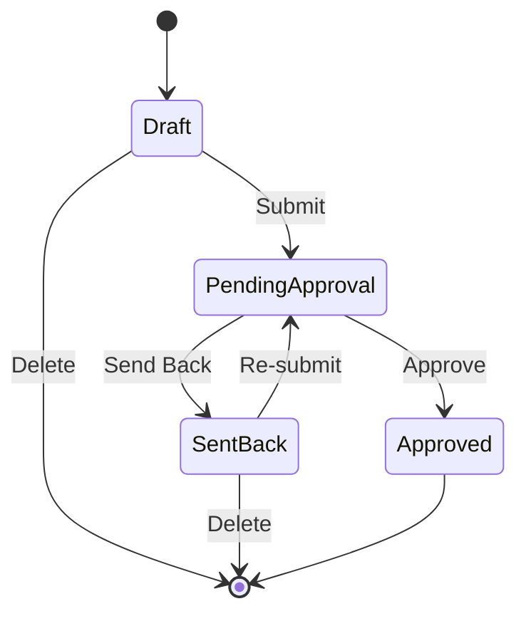

# Vehicle Master Maintenance - Requirements Analysis

> **Comprehensive breakdown of Vehicle Master Maintenance functionality for TMS application**

---

## 📋 Table of Contents

1. [Overview](#overview)
2. [Data Model Structure](#data-model-structure)
3. [Page Architecture](#page-architecture)
4. [Feature Breakdown](#feature-breakdown)
5. [Implementation Task List](#implementation-task-list)
6. [API Endpoints](#api-endpoints)
7. [Database Schema](#database-schema)
8. [Component Structure](#component-structure)
9. [Approval Workflow](#approval-workflow)
10. [Integration Points](#integration-points)

---

## 🎯 Overview

### Purpose
Vehicle Master Maintenance allows super admins to centrally manage vehicle data. Transporters cannot onboard vehicles themselves but must share details with Maventic for validation and creation.

### Key Features
- ✅ Create/Update Vehicle Records
- ✅ Bulk Upload Support with Validation
- ✅ Approval Workflow (1-level)
- ✅ GPS Tracker Integration
- ✅ Vehicle-Transporter/Owner Mapping
- ✅ Vehicle-Driver Mapping
- ✅ Blacklist Management
- ✅ Vehicle Dashboard with Analytics
- ✅ Duplicate Detection
- ✅ Service History Tracking
- ✅ Document Management
- ✅ Performance Reporting

### User Roles
- **Super Admin**: Full CRUD access
- **Admin**: Approval authority
- **Transporter**: View only (data sharing via external communication)
- **Vehicle Owner**: Can create via Owner App (requires admin approval)

---

## 📊 Data Model Structure

### 1. Basic Information Entity
```javascript
{
  vehicleId: String (System Generated, Unique),
  make: String (Mandatory),
  makerModel: String (Optional),
  yearOfManufacture: Number (Mandatory),
  vin: String (Mandatory, Unique),
  vehicleType: String (Dropdown, Mandatory),
  vehicleCategory: String (Optional),
  manufacturingMonthYear: Date (Mandatory),
  gpsTrackerImei: String (Mandatory),
  gpsTrackerActiveFlag: Boolean (Mandatory),
  leasingFlag: Boolean (Optional),
  avgRunningSpeed: Number (Optional),
  maxRunningSpeed: Number (Optional),
  usageType: Enum ['Passenger', 'Cargo', 'Special Equipment'] (Mandatory),
  safetyInspectionDate: Date (Optional),
  taxesAndFees: Number (Optional)
}
```

### 2. Vehicle Specifications Entity
```javascript
{
  vehicleId: String (Foreign Key),
  engineType: String (Mandatory),
  engineNumber: String (Mandatory),
  bodyTypeDescription: String (Optional),
  fuelType: String (Mandatory),
  transmissionType: String (Mandatory),
  color: String (Optional),
  emissionStandard: String (Optional),
  fitnessUpto: Date (Mandatory),
  taxUpto: Date (Mandatory),
  financer: String (Mandatory),
  suspensionType: String (Dropdown, Mandatory),
  weightDimensions: String (Mandatory)
}
```

### 3. Vehicle Capacity Entity
```javascript
{
  vehicleId: String (Foreign Key),
  unloadingWeight: Number (Mandatory),
  grossVehicleWeight: Number (Optional, KG),
  payloadCapacity: Number (Calculated: GVW - Curb Weight),
  volumeCapacity: Number (Optional, Cubic Meters),
  cargoWidth: Number (Optional, Meters),
  cargoHeight: Number (Optional, Meters),
  cargoLength: Number (Optional, Meters),
  towingCapacity: Number (Optional, KG),
  tireLoadRating: Number (Optional, KG per tire),
  vehicleCondition: Enum ['Excellent', 'Good', 'Fair', 'Poor'] (Optional),
  fuelTankCapacity: Number (Optional, Liters),
  seatingCapacity: Number (Optional)
}
```

### 4. Ownership Details Entity
```javascript
{
  ownerId: String (System Generated),
  vehicleId: String (Foreign Key),
  ownershipName: String (Optional),
  validFrom: Date (Optional),
  validTo: Date (Optional),
  registrationNumber: String (Optional),
  registrationDate: Date (Optional),
  registrationUpto: Date (Optional),
  purchaseDate: Date (Optional),
  ownerSrNumber: String (Optional),
  stateCode: String (Optional),
  rtoCode: String (Optional),
  presentAddressId: String (Optional),
  permanentAddressId: String (Optional),
  saleAmount: Number (Optional)
}
```

### 5. Maintenance & Service History Entity
```javascript
{
  maintenanceId: String (System Generated),
  vehicleId: String (Foreign Key),
  serviceDate: Date (Mandatory),
  serviceRemark: String (Optional),
  upcomingServiceDate: Date (Mandatory),
  typeOfService: String (Optional),
  serviceExpense: Number (Optional)
}
```

### 6. Service Frequency Entity
```javascript
{
  frequencyId: String (System Generated),
  vehicleId: String (Foreign Key),
  sequenceNumber: Number (System Generated),
  timePeriod: String (Optional),
  kmDrove: Number (Optional)
}
```

### 7. Vehicle Documents Entity
```javascript
{
  documentId: String (System Generated),
  vehicleId: String (Foreign Key),
  documentTypeId: String (Dropdown, Mandatory),
  // Options: AIP, Temp Vehicle Permit, Vehicle Insurance, PUC certificate, 
  // Permit certificate, Fitness Certificate, Vehicle Warranty, 
  // Vehicle Service Bill, Leasing Agreement
  referenceNumber: String (Optional),
  permitCategory: String (Optional),
  permitCode: String (Optional),
  documentProvider: String (Optional),
  coverageType: String (Optional),
  premiumAmount: Number (Optional),
  validFrom: Date (Mandatory),
  validTo: Date (Mandatory),
  remarks: String (Mandatory),
  documentUrl: String (Mandatory, File Upload)
}
```

### 8. GPS Tracker Entity
```javascript
{
  trackerId: String (System Generated),
  vehicleRegistrationNumber: String (Dropdown, Mandatory),
  gpsTrackerImei: String (Mandatory),
  unitId: String (Optional),
  activeFlag: Boolean (Mandatory)
}
```

### 9. Vehicle-Transporter/Owner Mapping Entity
```javascript
{
  mappingId: String (System Generated),
  transporterId: String (Foreign Key, Optional),
  ownerId: String (Foreign Key, Optional),
  vehicleId: String (Mandatory),
  validFrom: Date (Mandatory),
  validTo: Date (Mandatory),
  activeFlag: Boolean (Mandatory),
  remark: String (Mandatory)
}
```

### 10. Vehicle-Driver Mapping Entity
```javascript
{
  mappingId: String (System Generated),
  vehicleId: String (Foreign Key),
  driverId: String (Mandatory),
  validFrom: Date (Mandatory),
  validTo: Date (Mandatory),
  activeFlag: Boolean (Mandatory),
  remark: String (Optional)
}
```

### 11. Blacklist Mapping Entity
```javascript
{
  blacklistId: String (System Generated),
  vehicleId: String (Foreign Key),
  blacklistedBy: Enum ['Transporter', 'Consignor'] (Mandatory),
  blacklistedById: String (Mandatory),
  validFrom: Date (Mandatory),
  validTo: Date (Mandatory),
  remark: String (Optional),
  blacklistType: Enum ['Full', 'Partial']
}
```

### 12. Vehicle Status & Workflow Entity
```javascript
{
  vehicleId: String (Foreign Key),
  status: Enum ['Draft', 'Pending Approval', 'Approved', 'Sent Back', 'Rejected'],
  createdBy: String,
  createdAt: Date,
  updatedBy: String,
  updatedAt: Date,
  approvedBy: String,
  approvedAt: Date
}
```

### 13. Vehicle Performance Metrics Entity
```javascript
{
  performanceId: String (System Generated),
  vehicleId: String (Foreign Key),
  starRating: Number (0-5),
  tripsCompleted: Number,
  tripsOnTime: Number,
  accidents: Number,
  violations: Number,
  roi: Number,
  serviceExpense: Number,
  avgFuelConsumption: Number,
  perKmRunningCost: Number,
  calculatedAt: Date
}
```

---

## 🏗️ Page Architecture

### 1. Vehicle List Page (Maintenance View)
**Route**: `/vehicles`

**Purpose**: Display all vehicles with filtering, search, and bulk actions

**Components**:
- TopActionBar (Back, Create New, Bulk Upload, Filters, Logout)
- VehicleFilterPanel (Filter by Status, Type, Owner, GPS Status, etc.)
- VehicleListTable (Paginated table/cards with vehicle details)
- StatusPill (Draft, Pending, Approved, Sent Back, Rejected)
- PaginationBar (Gmail-style pagination)

**Key Features**:
- ✅ Search by Vehicle ID, Registration Number, VIN, Make, Model
- ✅ Filter by Status, Vehicle Type, Owner, GPS Active Flag
- ✅ Sort by Creation Date, Approval Date, Star Rating
- ✅ Bulk Actions: Bulk Upload, Export to Excel
- ✅ Quick Actions: View Details, Edit, Delete (if Draft/Sent Back)
- ✅ Status indicators with color coding

**Data Display Columns**:
| Column | Type | Sortable | Filterable |
|--------|------|----------|------------|
| Vehicle ID | Text Link | Yes | Yes |
| Registration Number | Text | Yes | Yes |
| Make/Model | Text | Yes | Yes |
| Vehicle Type | Badge | Yes | Yes |
| Owner Name | Text | No | Yes |
| GPS Status | Icon/Badge | No | Yes |
| Status | Status Pill | No | Yes |
| Star Rating | Stars | Yes | No |
| Actions | Button Group | No | No |

### 2. Vehicle Details Page (View Mode)
**Route**: `/vehicle/:vehicleId`

**Purpose**: Display comprehensive vehicle information in read-only mode

**Tab Structure**:
1. **Basic Information Tab**
   - Vehicle ID, Make, Model, Year, VIN
   - Vehicle Type, Category, Manufacturing Date
   - GPS Tracker Info, Usage Type
   - Safety Inspection, Taxes

2. **Specifications Tab**
   - Engine Type, Number, Body Type
   - Fuel Type, Transmission
   - Color, Emission Standard
   - Fitness & Tax Validity
   - Financer, Suspension Type

3. **Capacity Details Tab**
   - Weight Specifications
   - Volume Capacity
   - Cargo Dimensions
   - Towing Capacity
   - Tire Load Rating
   - Vehicle Condition
   - Calculated Payload Capacity

4. **Ownership Details Tab**
   - Owner Information
   - Registration Details
   - Address Information
   - Purchase Information

5. **Maintenance & Service Tab**
   - Service History Table
   - Upcoming Service Details
   - Service Frequency Configuration
   - Service Expense Tracking

6. **Documents Tab**
   - Document List with Types
   - Validity Status Indicators
   - Document Preview/Download
   - Document Upload (if editing)

7. **Mappings Tab**
   - Vehicle-Transporter Mapping Table
   - Vehicle-Driver Mapping Table
   - Blacklist Status

8. **Dashboard Tab**
   - Star Rating Widget
   - Trips Completed Chart
   - On-Time Performance Chart
   - Accidents & Violations Chart
   - Performance Metrics

9. **GPS Location Tab** (if GPS installed)
   - Current Location Map View
   - Last Updated Timestamp
   - GPS Tracker Status

**Action Buttons** (Top Right):
- Edit Vehicle (navigates to edit page)
- Back to List
- Approve (if Pending & user is approver)
- Send Back (if Pending & user is approver)
- Delete (if Draft/Sent Back & user is creator)

### 3. Create Vehicle Page
**Route**: `/vehicle/create`

**Purpose**: Multi-step form to create new vehicle record

**Step-by-Step Form**:
1. **Step 1: Basic Information** (Mandatory)
   - Make, Model, Year, VIN
   - Vehicle Type, Category
   - Manufacturing Date
   - GPS Tracker IMEI, Active Flag
   - Usage Type

2. **Step 2: Specifications** (Mandatory)
   - Engine Type, Number
   - Fuel Type, Transmission
   - Fitness & Tax Dates
   - Financer, Suspension Type

3. **Step 3: Capacity Details** (Mandatory)
   - Weight Specifications
   - Volume & Dimensions
   - Calculated Fields

4. **Step 4: Ownership Details** (Optional)
   - Owner Information
   - Registration Details
   - Address Selection

5. **Step 5: Documents** (Mandatory)
   - Add Multiple Documents
   - Document Type Selection
   - Validity Dates
   - File Upload

6. **Step 6: Review & Submit**
   - Summary of all entered data
   - Validation errors display
   - Action buttons

**Action Buttons**:
- Save as Draft
- Clear Form
- Submit for Approval
- Previous Step
- Next Step

**Validation Rules**:
- Duplicate check by Vehicle Number
- Duplicate check by VIN
- Mandatory field validation
- Date range validation
- File size validation (documents)

### 4. Edit Vehicle Page
**Route**: `/vehicle/:vehicleId/edit`

**Purpose**: Update existing vehicle information

**Similar to Create Page** with:
- Pre-filled form fields
- Additional: Vehicle Current Location (if GPS installed)
- Map view for GPS-enabled vehicles
- Update action (no approval required for edits)
- Delete option (if Draft/Sent Back)

**Additional Features**:
- Change History Log
- Last Updated By/At information
- Conditional fields based on GPS status

### 5. Bulk Upload Page
**Route**: `/vehicle/bulk-upload`

**Purpose**: Upload multiple vehicles via Excel file

**Components**:
- BulkUploadModal (File Selection)
- Template Download Button
- Upload Progress Bar
- Validation Results Table
- Parked Records for Verification

**Workflow**:
1. Download Template (Excel with all required columns)
2. Fill Template with Vehicle Data
3. Upload File
4. System Validates Data
5. Display Validation Errors (if any)
6. Data Parked in Draft Status
7. Maventic Team Reviews and Approves/Rejects

**Validation Checks**:
- Duplicate Vehicle Number
- Duplicate VIN
- Mandatory fields check
- Data type validation
- Date format validation

### 6. Approval Dashboard Page
**Route**: `/vehicle/approvals`

**Purpose**: List of vehicles pending approval

**Components**:
- Pending Approvals Table
- Approval Actions (Approve, Send Back)
- Filter by Created Date, Created By
- Bulk Approval Support

**Data Display**:
| Column | Type |
|--------|------|
| Vehicle ID | Link |
| Make/Model | Text |
| Created By | Text |
| Created Date | Date |
| Status | Pill |
| Actions | Buttons |

### 7. Vehicle Performance Report Page
**Route**: `/vehicle/:vehicleId/performance`

**Purpose**: Display detailed performance analytics

**Metrics Displayed**:
- ROI Calculation
- Service Expense Trends
- Average Fuel Consumption
- Per KM Running Cost
- Trip Performance Charts
- Accident & Violation History

**Components**:
- Performance Charts (Recharts)
- KPI Cards
- Date Range Filter
- Export to PDF/Excel

### 8. GPS Tracker Installation Page
**Route**: `/vehicle/gps-installation`

**Purpose**: Link GPS tracker to vehicle

**Form Fields**:
- Vehicle Registration Number (Dropdown)
- GPS Tracker IMEI Number (Input)
- Unit ID (Optional)
- Active Flag (Checkbox)

**Action**: Save Mapping

### 9. Vehicle Mapping Pages

#### 9.1 Vehicle-Transporter/Owner Mapping
**Route**: `/vehicle/:vehicleId/transporter-mapping`

**Features**:
- Add/Remove Transporter Mappings
- Bulk Upload Support
- Validity Date Management
- Active/Inactive Toggle

#### 9.2 Vehicle-Driver Mapping
**Route**: `/vehicle/:vehicleId/driver-mapping`

**Features**:
- Add/Remove Driver Mappings
- Validity Date Management
- Active/Inactive Toggle

#### 9.3 Blacklist Management
**Route**: `/vehicle/:vehicleId/blacklist`

**Features**:
- Full Blacklist (all transporters/consignors)
- Partial Blacklist (specific entities)
- Validity Period Management
- Remarks Field

---

## 🔧 Feature Breakdown

### Feature 1: Vehicle CRUD Operations

#### Create Vehicle
**User Story**: As a Super Admin, I want to create a new vehicle record with all required information so that it can be used for transportation operations.

**Acceptance Criteria**:
- [ ] Form validates all mandatory fields
- [ ] System generates unique Vehicle ID
- [ ] Duplicate check by Vehicle Number and VIN
- [ ] Form can be saved as Draft
- [ ] Form can be submitted for approval
- [ ] Approval workflow triggers on submit
- [ ] Form can be cleared

**Technical Tasks**:
- [ ] Create multi-step form component
- [ ] Implement form validation with Zod
- [ ] Create API endpoint: `POST /api/vehicle`
- [ ] Implement duplicate check logic
- [ ] Create approval workflow service
- [ ] Implement draft save functionality
- [ ] Add form state management in Redux

#### Read Vehicle
**User Story**: As a user, I want to view detailed information about a vehicle so that I can understand its specifications and status.

**Acceptance Criteria**:
- [ ] All vehicle information displayed in tabs
- [ ] GPS location shown on map (if installed)
- [ ] Service history displayed chronologically
- [ ] Documents list with preview/download
- [ ] Performance metrics visible
- [ ] Mapping information displayed

**Technical Tasks**:
- [ ] Create vehicle details page with tabs
- [ ] Implement map integration (Google Maps/Mapbox)
- [ ] Create document preview component
- [ ] Implement performance charts
- [ ] Create API endpoint: `GET /api/vehicle/:id`

#### Update Vehicle
**User Story**: As a Super Admin, I want to update vehicle information when details change so that the system has accurate data.

**Acceptance Criteria**:
- [ ] Pre-filled form with existing data
- [ ] All fields editable except Vehicle ID
- [ ] No approval required for updates
- [ ] Duplicate check on Vehicle Number/VIN change
- [ ] Update history tracked

**Technical Tasks**:
- [ ] Create edit form component
- [ ] Implement pre-fill logic
- [ ] Create API endpoint: `PUT /api/vehicle/:id`
- [ ] Add update history tracking
- [ ] Implement optimistic updates in Redux

#### Delete Vehicle
**User Story**: As a Super Admin, I want to delete draft or sent-back vehicle records so that incorrect data doesn't clutter the system.

**Acceptance Criteria**:
- [ ] Delete only allowed for Draft/Sent Back status
- [ ] Confirmation dialog before delete
- [ ] Soft delete (archive) instead of hard delete
- [ ] Audit trail maintained

**Technical Tasks**:
- [ ] Implement status-based delete permission
- [ ] Create confirmation modal
- [ ] Create API endpoint: `DELETE /api/vehicle/:id`
- [ ] Implement soft delete logic
- [ ] Add audit log entry

---

### Feature 2: Bulk Upload Support

**User Story**: As a Super Admin, I want to upload multiple vehicles at once via Excel so that I can quickly onboard vehicle data.

**Acceptance Criteria**:
- [ ] Template download available
- [ ] File upload with validation
- [ ] Validation errors displayed clearly
- [ ] Records parked in Draft status
- [ ] Bulk approval support

**Technical Tasks**:
- [ ] Create Excel template generator
- [ ] Implement file upload component
- [ ] Create Excel parsing service (using `xlsx` library)
- [ ] Implement bulk validation logic
- [ ] Create API endpoint: `POST /api/vehicle/bulk-upload`
- [ ] Create bulk approval interface
- [ ] Add progress indicator

**Excel Template Columns**:
All fields from Basic Information, Specifications, Capacity, Ownership, and Documents sections

---

### Feature 3: Approval Workflow

**User Story**: As an Admin, I want to review and approve vehicle records created by others so that only validated data enters the system.

**Acceptance Criteria**:
- [ ] Approval dashboard shows pending records
- [ ] Approver can view full vehicle details
- [ ] Approve action moves status to Approved
- [ ] Send Back action returns to initiator
- [ ] Email notifications sent on status change
- [ ] Approval history tracked

**Technical Tasks**:
- [ ] Create approval dashboard page
- [ ] Implement approval actions (Approve, Send Back)
- [ ] Create workflow state machine
- [ ] Create API endpoints:
  - `POST /api/vehicle/:id/approve`
  - `POST /api/vehicle/:id/send-back`
- [ ] Implement email notification service
- [ ] Add approval history tracking
- [ ] Create workflow status component

**Workflow States**:
```
Draft → Pending Approval → Approved
            ↓
        Sent Back → Pending Approval
```

---

### Feature 4: GPS Tracker Integration

**User Story**: As a Super Admin, I want to link GPS trackers to vehicles so that I can track their real-time location.

**Acceptance Criteria**:
- [ ] GPS tracker can be linked via IMEI number
- [ ] Vehicle location displayed on map
- [ ] GPS status (Active/Inactive) visible
- [ ] Last updated timestamp shown
- [ ] Multiple trackers can be linked (history)

**Technical Tasks**:
- [ ] Create GPS installation form
- [ ] Implement map integration
- [ ] Create API endpoint: `POST /api/vehicle/gps-link`
- [ ] Create GPS data polling service
- [ ] Implement real-time location updates (WebSocket)
- [ ] Create GPS status indicator component

---

### Feature 5: Vehicle-Transporter/Owner Mapping

**User Story**: As a Super Admin, I want to map vehicles to transporters/owners so that I can track vehicle ownership and usage rights.

**Acceptance Criteria**:
- [ ] One vehicle can have multiple mappings
- [ ] Validity period enforced
- [ ] Active/Inactive flag supported
- [ ] Bulk upload available
- [ ] Mapping history maintained

**Technical Tasks**:
- [ ] Create mapping form component
- [ ] Create mapping list table
- [ ] Implement validity date validation
- [ ] Create API endpoints:
  - `POST /api/vehicle/:id/mapping/transporter`
  - `GET /api/vehicle/:id/mapping/transporter`
  - `PUT /api/vehicle/:id/mapping/transporter/:mappingId`
  - `DELETE /api/vehicle/:id/mapping/transporter/:mappingId`
- [ ] Implement bulk upload for mappings
- [ ] Add mapping history tracking

---

### Feature 6: Vehicle-Driver Mapping

**User Story**: As a Super Admin, I want to map vehicles to drivers so that I can track which driver is assigned to which vehicle.

**Acceptance Criteria**:
- [ ] One vehicle can be mapped to multiple drivers (over time)
- [ ] Validity period enforced
- [ ] Active/Inactive flag supported
- [ ] Only one active mapping per vehicle at a time

**Technical Tasks**:
- [ ] Create driver mapping form
- [ ] Implement active mapping validation
- [ ] Create API endpoints:
  - `POST /api/vehicle/:id/mapping/driver`
  - `GET /api/vehicle/:id/mapping/driver`
  - `PUT /api/vehicle/:id/mapping/driver/:mappingId`
  - `DELETE /api/vehicle/:id/mapping/driver/:mappingId`

---

### Feature 7: Blacklist Management

**User Story**: As a Super Admin, I want to blacklist vehicles for specific transporters/consignors so that they cannot use those vehicles for operations.

**Acceptance Criteria**:
- [ ] Full blacklist blocks vehicle for all
- [ ] Partial blacklist blocks for specific entities
- [ ] Validity period supported
- [ ] Blacklist status visible in vehicle details
- [ ] System prevents blacklisted vehicles from assignment

**Technical Tasks**:
- [ ] Create blacklist form component
- [ ] Implement full vs partial blacklist logic
- [ ] Create API endpoints:
  - `POST /api/vehicle/:id/blacklist`
  - `GET /api/vehicle/:id/blacklist`
  - `DELETE /api/vehicle/:id/blacklist/:blacklistId`
- [ ] Add blacklist validation in assignment workflows
- [ ] Create blacklist status indicator

---

### Feature 8: Vehicle Dashboard

**User Story**: As a user, I want to see vehicle performance metrics graphically so that I can quickly assess vehicle efficiency.

**Acceptance Criteria**:
- [ ] Star rating displayed (0-5)
- [ ] Number of trips completed shown
- [ ] On-time performance percentage shown
- [ ] Accidents count displayed
- [ ] Violations count displayed
- [ ] Charts use graphical representation

**Technical Tasks**:
- [ ] Create dashboard tab component
- [ ] Implement KPI cards
- [ ] Create charts using Recharts:
  - Trip completion trend
  - On-time performance gauge
  - Accident timeline
  - Violation categories
- [ ] Create API endpoint: `GET /api/vehicle/:id/dashboard`
- [ ] Calculate performance metrics

---

### Feature 9: Maintenance & Service History

**User Story**: As a Super Admin, I want to track vehicle maintenance history so that I can ensure vehicles are properly serviced.

**Acceptance Criteria**:
- [ ] Service records can be added
- [ ] Service history displayed chronologically
- [ ] Upcoming service date tracked
- [ ] Service expense recorded
- [ ] Service frequency configured

**Technical Tasks**:
- [ ] Create service history form
- [ ] Create service history table
- [ ] Implement upcoming service reminder
- [ ] Create API endpoints:
  - `POST /api/vehicle/:id/service`
  - `GET /api/vehicle/:id/service`
  - `PUT /api/vehicle/:id/service/:serviceId`
  - `DELETE /api/vehicle/:id/service/:serviceId`
- [ ] Add service reminder notifications

---

### Feature 10: Document Management

**User Story**: As a Super Admin, I want to upload and manage vehicle documents so that all legal paperwork is available in the system.

**Acceptance Criteria**:
- [ ] Multiple document types supported
- [ ] Document validity tracked
- [ ] Expired documents highlighted
- [ ] Document preview/download available
- [ ] File upload with size limits

**Technical Tasks**:
- [ ] Create document upload component
- [ ] Implement file storage (AWS S3 / local storage)
- [ ] Create document list table
- [ ] Implement document validity checker
- [ ] Create API endpoints:
  - `POST /api/vehicle/:id/document`
  - `GET /api/vehicle/:id/document`
  - `DELETE /api/vehicle/:id/document/:documentId`
  - `GET /api/vehicle/:id/document/:documentId/download`
- [ ] Add document expiry notifications

---

### Feature 11: Performance Reporting

**User Story**: As a Super Admin, I want to view vehicle performance reports so that I can analyze ROI and efficiency.

**Acceptance Criteria**:
- [ ] ROI calculated and displayed
- [ ] Service expense trends shown
- [ ] Average fuel consumption tracked
- [ ] Per KM running cost calculated
- [ ] Date range filter available
- [ ] Export to PDF/Excel supported

**Technical Tasks**:
- [ ] Create performance report page
- [ ] Implement calculation logic:
  - ROI = (Revenue - Total Costs) / Total Costs
  - Per KM cost = Total Costs / Total KM
  - Avg fuel = Total Fuel / Total KM
- [ ] Create charts for trends
- [ ] Implement export functionality
- [ ] Create API endpoint: `GET /api/vehicle/:id/performance`

---

## ✅ Implementation Task List

### Phase 1: Database & Backend Foundation (Week 1-2)

#### Database Schema
- [ ] Create `vehicles` table (basic info)
- [ ] Create `vehicle_specifications` table
- [ ] Create `vehicle_capacity` table
- [ ] Create `vehicle_ownership` table
- [ ] Create `vehicle_maintenance` table
- [ ] Create `vehicle_service_frequency` table
- [ ] Create `vehicle_documents` table
- [ ] Create `vehicle_gps_tracker` table
- [ ] Create `vehicle_transporter_mapping` table
- [ ] Create `vehicle_driver_mapping` table
- [ ] Create `vehicle_blacklist` table
- [ ] Create `vehicle_status_workflow` table
- [ ] Create `vehicle_performance_metrics` table
- [ ] Create `vehicle_audit_log` table
- [ ] Add indexes for performance optimization
- [ ] Add foreign key constraints
- [ ] Create database migrations

#### Backend API - Basic CRUD
- [ ] Create vehicle model (Knex queries)
- [ ] Create vehicle controller
- [ ] Create vehicle routes
- [ ] Implement `POST /api/vehicle` (Create)
- [ ] Implement `GET /api/vehicle` (List with pagination/filters)
- [ ] Implement `GET /api/vehicle/:id` (Get single)
- [ ] Implement `PUT /api/vehicle/:id` (Update)
- [ ] Implement `DELETE /api/vehicle/:id` (Soft delete)
- [ ] Add request validation (Zod schemas)
- [ ] Add authentication middleware
- [ ] Add authorization middleware (role-based)
- [ ] Implement duplicate check logic

#### Backend API - Advanced Features
- [ ] Implement `POST /api/vehicle/bulk-upload`
- [ ] Create Excel parsing service
- [ ] Implement bulk validation logic
- [ ] Implement `POST /api/vehicle/:id/approve`
- [ ] Implement `POST /api/vehicle/:id/send-back`
- [ ] Create workflow state machine
- [ ] Implement `POST /api/vehicle/:id/gps-link`
- [ ] Implement `GET /api/vehicle/:id/location` (GPS tracking)
- [ ] Implement mapping endpoints (transporter, driver)
- [ ] Implement blacklist endpoints
- [ ] Implement dashboard metrics endpoint
- [ ] Implement service history endpoints
- [ ] Implement document endpoints
- [ ] Implement performance report endpoint
- [ ] Add email notification service
- [ ] Add file upload service (Multer/AWS S3)
- [ ] Create audit logging service

### Phase 2: Frontend Components (Week 3-4)

#### Reusable Components
- [ ] Create VehicleCard component
- [ ] Create VehicleStatusPill component
- [ ] Create VehicleFilterPanel component
- [ ] Create VehicleTable component
- [ ] Create GPSMapView component
- [ ] Create DocumentUpload component
- [ ] Create DocumentList component
- [ ] Create ServiceHistoryTable component
- [ ] Create PerformanceChart component
- [ ] Create ApprovalActions component
- [ ] Create MappingForm component
- [ ] Create BlacklistForm component
- [ ] Create BulkUploadModal component

#### Page Components
- [ ] Create VehicleListPage
- [ ] Create VehicleDetailsPage
- [ ] Create CreateVehiclePage (multi-step form)
- [ ] Create EditVehiclePage
- [ ] Create BulkUploadPage
- [ ] Create ApprovalDashboardPage
- [ ] Create GPSInstallationPage
- [ ] Create VehicleMappingPage
- [ ] Create BlacklistManagementPage
- [ ] Create PerformanceReportPage

#### Tab Components (for Details/Edit pages)
- [ ] Create BasicInformationTab
- [ ] Create SpecificationsTab
- [ ] Create CapacityDetailsTab
- [ ] Create OwnershipDetailsTab
- [ ] Create MaintenanceServiceTab
- [ ] Create DocumentsTab
- [ ] Create MappingsTab
- [ ] Create DashboardTab
- [ ] Create GPSLocationTab

### Phase 3: State Management (Week 4)

#### Redux Slices
- [ ] Create vehicleSlice (CRUD operations)
- [ ] Add `fetchVehicles` async thunk
- [ ] Add `fetchVehicleById` async thunk
- [ ] Add `createVehicle` async thunk
- [ ] Add `updateVehicle` async thunk
- [ ] Add `deleteVehicle` async thunk
- [ ] Add `bulkUploadVehicles` async thunk
- [ ] Add `approveVehicle` async thunk
- [ ] Add `sendBackVehicle` async thunk
- [ ] Add `fetchVehicleDashboard` async thunk
- [ ] Add `fetchVehiclePerformance` async thunk
- [ ] Add filters state management
- [ ] Add pagination state management
- [ ] Add loading/error states
- [ ] Add optimistic updates

### Phase 4: Integration & Testing (Week 5)

#### API Integration
- [ ] Connect all API endpoints to Redux
- [ ] Implement error handling
- [ ] Add loading states
- [ ] Add success/error notifications
- [ ] Implement real-time GPS updates (WebSocket)
- [ ] Add file upload progress
- [ ] Implement retry logic for failed requests

#### Testing
- [ ] Write unit tests for API endpoints
- [ ] Write unit tests for Redux slices
- [ ] Write integration tests for workflows
- [ ] Test approval workflow end-to-end
- [ ] Test bulk upload with various files
- [ ] Test GPS integration
- [ ] Test document upload/download
- [ ] Test performance calculations
- [ ] Test duplicate detection
- [ ] Test role-based access control

#### UI/UX Polish
- [ ] Add loading skeletons
- [ ] Add empty states
- [ ] Add error states
- [ ] Implement responsive design
- [ ] Add animations/transitions
- [ ] Optimize performance (lazy loading, memoization)
- [ ] Add accessibility features (ARIA labels, keyboard navigation)

### Phase 5: Advanced Features (Week 6)

#### Notifications
- [ ] Email notification on approval/rejection
- [ ] Email notification on document expiry
- [ ] Email notification on service due
- [ ] In-app notifications
- [ ] Push notifications (optional)

#### Reporting
- [ ] Export vehicle list to Excel
- [ ] Export performance report to PDF
- [ ] Export service history to Excel
- [ ] Generate vehicle summary report

#### Search & Filters
- [ ] Implement fuzzy search
- [ ] Add advanced filters
- [ ] Add saved filter presets
- [ ] Add sort options

#### Audit Trail
- [ ] Display change history
- [ ] Track who created/updated records
- [ ] Display approval history
- [ ] Log all actions

---

## 🔌 API Endpoints

### Vehicle CRUD
```
POST   /api/vehicle                    Create new vehicle
GET    /api/vehicle                    List vehicles (with filters/pagination)
GET    /api/vehicle/:id                Get vehicle details
PUT    /api/vehicle/:id                Update vehicle
DELETE /api/vehicle/:id                Delete vehicle (soft delete)
```

### Bulk Operations
```
POST   /api/vehicle/bulk-upload        Upload Excel file
GET    /api/vehicle/bulk-template      Download Excel template
GET    /api/vehicle/bulk/:batchId      Get bulk upload status
```

### Approval Workflow
```
POST   /api/vehicle/:id/approve        Approve vehicle
POST   /api/vehicle/:id/send-back      Send back for correction
GET    /api/vehicle/pending-approvals  List pending approvals
```

### GPS Tracker
```
POST   /api/vehicle/gps-link           Link GPS tracker to vehicle
GET    /api/vehicle/:id/location       Get current location
GET    /api/vehicle/:id/location-history  Get location history
```

### Mappings
```
POST   /api/vehicle/:id/mapping/transporter      Create transporter mapping
GET    /api/vehicle/:id/mapping/transporter      List transporter mappings
PUT    /api/vehicle/:id/mapping/transporter/:mid Update mapping
DELETE /api/vehicle/:id/mapping/transporter/:mid Delete mapping

POST   /api/vehicle/:id/mapping/driver           Create driver mapping
GET    /api/vehicle/:id/mapping/driver           List driver mappings
PUT    /api/vehicle/:id/mapping/driver/:mid      Update mapping
DELETE /api/vehicle/:id/mapping/driver/:mid      Delete mapping
```

### Blacklist
```
POST   /api/vehicle/:id/blacklist       Add to blacklist
GET    /api/vehicle/:id/blacklist       Get blacklist status
DELETE /api/vehicle/:id/blacklist/:bid  Remove from blacklist
```

### Dashboard & Performance
```
GET    /api/vehicle/:id/dashboard       Get dashboard metrics
GET    /api/vehicle/:id/performance     Get performance report
GET    /api/vehicle/:id/service-history Get service history
```

### Documents
```
POST   /api/vehicle/:id/document        Upload document
GET    /api/vehicle/:id/document        List documents
GET    /api/vehicle/:id/document/:did   Get document details
DELETE /api/vehicle/:id/document/:did   Delete document
GET    /api/vehicle/:id/document/:did/download Download document
```

### Service History
```
POST   /api/vehicle/:id/service         Add service record
GET    /api/vehicle/:id/service         List service records
PUT    /api/vehicle/:id/service/:sid    Update service record
DELETE /api/vehicle/:id/service/:sid    Delete service record
```

---

## 🗄️ Database Schema

### Table: `vehicles`
```sql
CREATE TABLE vehicles (
  vehicle_id VARCHAR(20) PRIMARY KEY,
  make VARCHAR(100) NOT NULL,
  maker_model VARCHAR(100),
  year_of_manufacture INT NOT NULL,
  vin VARCHAR(50) UNIQUE NOT NULL,
  vehicle_type VARCHAR(50) NOT NULL,
  vehicle_category VARCHAR(50),
  manufacturing_month_year DATE NOT NULL,
  gps_tracker_imei VARCHAR(50) NOT NULL,
  gps_tracker_active_flag BOOLEAN NOT NULL DEFAULT false,
  leasing_flag BOOLEAN,
  avg_running_speed DECIMAL(10,2),
  max_running_speed DECIMAL(10,2),
  usage_type ENUM('Passenger', 'Cargo', 'Special Equipment') NOT NULL,
  safety_inspection_date DATE,
  taxes_and_fees DECIMAL(10,2),
  status ENUM('Draft', 'Pending Approval', 'Approved', 'Sent Back', 'Rejected') DEFAULT 'Draft',
  created_by VARCHAR(50),
  created_at TIMESTAMP DEFAULT CURRENT_TIMESTAMP,
  updated_by VARCHAR(50),
  updated_at TIMESTAMP DEFAULT CURRENT_TIMESTAMP ON UPDATE CURRENT_TIMESTAMP,
  approved_by VARCHAR(50),
  approved_at TIMESTAMP,
  deleted_at TIMESTAMP NULL,
  INDEX idx_status (status),
  INDEX idx_vehicle_type (vehicle_type),
  INDEX idx_created_at (created_at)
);
```

### Table: `vehicle_specifications`
```sql
CREATE TABLE vehicle_specifications (
  spec_id INT PRIMARY KEY AUTO_INCREMENT,
  vehicle_id VARCHAR(20) NOT NULL,
  engine_type VARCHAR(50) NOT NULL,
  engine_number VARCHAR(50) NOT NULL,
  body_type_description TEXT,
  fuel_type VARCHAR(50) NOT NULL,
  transmission_type VARCHAR(50) NOT NULL,
  color VARCHAR(30),
  emission_standard VARCHAR(50),
  fitness_upto DATE NOT NULL,
  tax_upto DATE NOT NULL,
  financer VARCHAR(100) NOT NULL,
  suspension_type VARCHAR(50) NOT NULL,
  weight_dimensions TEXT NOT NULL,
  created_at TIMESTAMP DEFAULT CURRENT_TIMESTAMP,
  updated_at TIMESTAMP DEFAULT CURRENT_TIMESTAMP ON UPDATE CURRENT_TIMESTAMP,
  FOREIGN KEY (vehicle_id) REFERENCES vehicles(vehicle_id) ON DELETE CASCADE
);
```

### Table: `vehicle_capacity`
```sql
CREATE TABLE vehicle_capacity (
  capacity_id INT PRIMARY KEY AUTO_INCREMENT,
  vehicle_id VARCHAR(20) NOT NULL,
  unloading_weight DECIMAL(10,2) NOT NULL,
  gross_vehicle_weight DECIMAL(10,2),
  payload_capacity DECIMAL(10,2) GENERATED ALWAYS AS (gross_vehicle_weight - unloading_weight) STORED,
  volume_capacity DECIMAL(10,2),
  cargo_width DECIMAL(10,2),
  cargo_height DECIMAL(10,2),
  cargo_length DECIMAL(10,2),
  towing_capacity DECIMAL(10,2),
  tire_load_rating DECIMAL(10,2),
  vehicle_condition ENUM('Excellent', 'Good', 'Fair', 'Poor'),
  fuel_tank_capacity DECIMAL(10,2),
  seating_capacity INT,
  created_at TIMESTAMP DEFAULT CURRENT_TIMESTAMP,
  updated_at TIMESTAMP DEFAULT CURRENT_TIMESTAMP ON UPDATE CURRENT_TIMESTAMP,
  FOREIGN KEY (vehicle_id) REFERENCES vehicles(vehicle_id) ON DELETE CASCADE
);
```

### Table: `vehicle_ownership`
```sql
CREATE TABLE vehicle_ownership (
  owner_id VARCHAR(20) PRIMARY KEY,
  vehicle_id VARCHAR(20) NOT NULL,
  ownership_name VARCHAR(100),
  valid_from DATE,
  valid_to DATE,
  registration_number VARCHAR(50),
  registration_date DATE,
  registration_upto DATE,
  purchase_date DATE,
  owner_sr_number VARCHAR(50),
  state_code VARCHAR(10),
  rto_code VARCHAR(20),
  present_address_id VARCHAR(20),
  permanent_address_id VARCHAR(20),
  sale_amount DECIMAL(12,2),
  created_at TIMESTAMP DEFAULT CURRENT_TIMESTAMP,
  updated_at TIMESTAMP DEFAULT CURRENT_TIMESTAMP ON UPDATE CURRENT_TIMESTAMP,
  FOREIGN KEY (vehicle_id) REFERENCES vehicles(vehicle_id) ON DELETE CASCADE
);
```

### Table: `vehicle_maintenance`
```sql
CREATE TABLE vehicle_maintenance (
  maintenance_id INT PRIMARY KEY AUTO_INCREMENT,
  vehicle_id VARCHAR(20) NOT NULL,
  service_date DATE NOT NULL,
  service_remark TEXT,
  upcoming_service_date DATE NOT NULL,
  type_of_service VARCHAR(100),
  service_expense DECIMAL(10,2),
  created_at TIMESTAMP DEFAULT CURRENT_TIMESTAMP,
  updated_at TIMESTAMP DEFAULT CURRENT_TIMESTAMP ON UPDATE CURRENT_TIMESTAMP,
  FOREIGN KEY (vehicle_id) REFERENCES vehicles(vehicle_id) ON DELETE CASCADE,
  INDEX idx_service_date (service_date),
  INDEX idx_upcoming_service (upcoming_service_date)
);
```

### Table: `vehicle_service_frequency`
```sql
CREATE TABLE vehicle_service_frequency (
  frequency_id INT PRIMARY KEY AUTO_INCREMENT,
  vehicle_id VARCHAR(20) NOT NULL,
  sequence_number INT,
  time_period VARCHAR(50),
  km_drove DECIMAL(10,2),
  created_at TIMESTAMP DEFAULT CURRENT_TIMESTAMP,
  FOREIGN KEY (vehicle_id) REFERENCES vehicles(vehicle_id) ON DELETE CASCADE
);
```

### Table: `vehicle_documents`
```sql
CREATE TABLE vehicle_documents (
  document_id INT PRIMARY KEY AUTO_INCREMENT,
  vehicle_id VARCHAR(20) NOT NULL,
  document_type_id VARCHAR(10) NOT NULL,
  reference_number VARCHAR(100),
  permit_category VARCHAR(50),
  permit_code VARCHAR(50),
  document_provider VARCHAR(100),
  coverage_type VARCHAR(50),
  premium_amount DECIMAL(10,2),
  valid_from DATE NOT NULL,
  valid_to DATE NOT NULL,
  remarks TEXT NOT NULL,
  document_url VARCHAR(500) NOT NULL,
  created_at TIMESTAMP DEFAULT CURRENT_TIMESTAMP,
  updated_at TIMESTAMP DEFAULT CURRENT_TIMESTAMP ON UPDATE CURRENT_TIMESTAMP,
  FOREIGN KEY (vehicle_id) REFERENCES vehicles(vehicle_id) ON DELETE CASCADE,
  INDEX idx_valid_to (valid_to),
  INDEX idx_document_type (document_type_id)
);
```

### Table: `vehicle_gps_tracker`
```sql
CREATE TABLE vehicle_gps_tracker (
  tracker_id INT PRIMARY KEY AUTO_INCREMENT,
  vehicle_registration_number VARCHAR(50) NOT NULL,
  gps_tracker_imei VARCHAR(50) NOT NULL,
  unit_id VARCHAR(50),
  active_flag BOOLEAN NOT NULL DEFAULT true,
  created_at TIMESTAMP DEFAULT CURRENT_TIMESTAMP,
  updated_at TIMESTAMP DEFAULT CURRENT_TIMESTAMP ON UPDATE CURRENT_TIMESTAMP,
  INDEX idx_imei (gps_tracker_imei),
  INDEX idx_registration (vehicle_registration_number)
);
```

### Table: `vehicle_transporter_mapping`
```sql
CREATE TABLE vehicle_transporter_mapping (
  mapping_id INT PRIMARY KEY AUTO_INCREMENT,
  transporter_id VARCHAR(20),
  owner_id VARCHAR(20),
  vehicle_id VARCHAR(20) NOT NULL,
  valid_from DATE NOT NULL,
  valid_to DATE NOT NULL,
  active_flag BOOLEAN NOT NULL DEFAULT true,
  remark TEXT NOT NULL,
  created_at TIMESTAMP DEFAULT CURRENT_TIMESTAMP,
  updated_at TIMESTAMP DEFAULT CURRENT_TIMESTAMP ON UPDATE CURRENT_TIMESTAMP,
  FOREIGN KEY (vehicle_id) REFERENCES vehicles(vehicle_id) ON DELETE CASCADE,
  INDEX idx_transporter (transporter_id),
  INDEX idx_owner (owner_id),
  INDEX idx_active (active_flag)
);
```

### Table: `vehicle_driver_mapping`
```sql
CREATE TABLE vehicle_driver_mapping (
  mapping_id INT PRIMARY KEY AUTO_INCREMENT,
  vehicle_id VARCHAR(20) NOT NULL,
  driver_id VARCHAR(20) NOT NULL,
  valid_from DATE NOT NULL,
  valid_to DATE NOT NULL,
  active_flag BOOLEAN NOT NULL DEFAULT true,
  remark TEXT,
  created_at TIMESTAMP DEFAULT CURRENT_TIMESTAMP,
  updated_at TIMESTAMP DEFAULT CURRENT_TIMESTAMP ON UPDATE CURRENT_TIMESTAMP,
  FOREIGN KEY (vehicle_id) REFERENCES vehicles(vehicle_id) ON DELETE CASCADE,
  INDEX idx_driver (driver_id),
  INDEX idx_active (active_flag)
);
```

### Table: `vehicle_blacklist`
```sql
CREATE TABLE vehicle_blacklist (
  blacklist_id INT PRIMARY KEY AUTO_INCREMENT,
  vehicle_id VARCHAR(20) NOT NULL,
  blacklisted_by ENUM('Transporter', 'Consignor') NOT NULL,
  blacklisted_by_id VARCHAR(20) NOT NULL,
  blacklist_type ENUM('Full', 'Partial') NOT NULL,
  valid_from DATE NOT NULL,
  valid_to DATE NOT NULL,
  remark TEXT,
  created_at TIMESTAMP DEFAULT CURRENT_TIMESTAMP,
  updated_at TIMESTAMP DEFAULT CURRENT_TIMESTAMP ON UPDATE CURRENT_TIMESTAMP,
  FOREIGN KEY (vehicle_id) REFERENCES vehicles(vehicle_id) ON DELETE CASCADE,
  INDEX idx_blacklist_type (blacklist_type),
  INDEX idx_vehicle_blacklist (vehicle_id, valid_from, valid_to)
);
```

### Table: `vehicle_performance_metrics`
```sql
CREATE TABLE vehicle_performance_metrics (
  performance_id INT PRIMARY KEY AUTO_INCREMENT,
  vehicle_id VARCHAR(20) NOT NULL,
  star_rating DECIMAL(2,1) CHECK (star_rating >= 0 AND star_rating <= 5),
  trips_completed INT DEFAULT 0,
  trips_on_time INT DEFAULT 0,
  accidents INT DEFAULT 0,
  violations INT DEFAULT 0,
  roi DECIMAL(10,2),
  service_expense DECIMAL(10,2),
  avg_fuel_consumption DECIMAL(10,2),
  per_km_running_cost DECIMAL(10,2),
  calculated_at TIMESTAMP DEFAULT CURRENT_TIMESTAMP,
  FOREIGN KEY (vehicle_id) REFERENCES vehicles(vehicle_id) ON DELETE CASCADE,
  INDEX idx_star_rating (star_rating),
  INDEX idx_calculated_at (calculated_at)
);
```

### Table: `vehicle_audit_log`
```sql
CREATE TABLE vehicle_audit_log (
  log_id INT PRIMARY KEY AUTO_INCREMENT,
  vehicle_id VARCHAR(20) NOT NULL,
  action VARCHAR(50) NOT NULL,
  old_value TEXT,
  new_value TEXT,
  changed_by VARCHAR(50) NOT NULL,
  changed_at TIMESTAMP DEFAULT CURRENT_TIMESTAMP,
  FOREIGN KEY (vehicle_id) REFERENCES vehicles(vehicle_id) ON DELETE CASCADE,
  INDEX idx_vehicle_audit (vehicle_id, changed_at)
);
```

---

## 🧩 Component Structure

### Component Hierarchy
```
VehicleListPage
├── TopActionBar
│   ├── BackButton
│   ├── CreateNewButton
│   ├── BulkUploadButton
│   └── FilterButton
├── VehicleFilterPanel
│   ├── SearchInput
│   ├── StatusFilter
│   ├── TypeFilter
│   ├── OwnerFilter
│   ├── GPSStatusFilter
│   ├── ApplyButton
│   └── ClearButton
├── VehicleListTable
│   ├── TableHeader
│   ├── VehicleCard (Mobile)
│   │   ├── VehicleID
│   │   ├── StatusPill
│   │   ├── StarRating
│   │   └── ActionButtons
│   ├── TableRow (Desktop)
│   │   ├── VehicleID (Link)
│   │   ├── RegistrationNumber
│   │   ├── MakeModel
│   │   ├── VehicleType
│   │   ├── OwnerName
│   │   ├── GPSStatus
│   │   ├── StatusPill
│   │   ├── StarRating
│   │   └── ActionButtons
│   └── LoadingSpinner
└── PaginationBar
    ├── PreviousButton
    ├── PageNumbers
    └── NextButton

VehicleDetailsPage
├── TopActionBar
│   ├── BackButton
│   ├── EditButton
│   ├── ApproveButton (conditional)
│   ├── SendBackButton (conditional)
│   └── DeleteButton (conditional)
├── TabNavigation
│   ├── BasicInfoTab
│   │   ├── VehicleInfoCard
│   │   └── GPSInfoCard
│   ├── SpecificationsTab
│   │   └── SpecCard
│   ├── CapacityTab
│   │   ├── WeightCard
│   │   └── DimensionsCard
│   ├── OwnershipTab
│   │   ├── OwnerCard
│   │   └── RegistrationCard
│   ├── MaintenanceTab
│   │   ├── ServiceHistoryTable
│   │   └── UpcomingServiceCard
│   ├── DocumentsTab
│   │   ├── DocumentList
│   │   │   ├── DocumentCard
│   │   │   │   ├── DocumentType
│   │   │   │   ├── ValidityStatus
│   │   │   │   └── DownloadButton
│   │   │   └── UploadButton
│   ├── MappingsTab
│   │   ├── TransporterMappingTable
│   │   ├── DriverMappingTable
│   │   └── BlacklistStatus
│   ├── DashboardTab
│   │   ├── StarRatingWidget
│   │   ├── TripsCompletedChart
│   │   ├── OnTimePerformanceGauge
│   │   ├── AccidentsChart
│   │   └── ViolationsChart
│   └── GPSLocationTab
│       ├── MapView
│       └── LocationInfo

CreateVehiclePage
├── TopActionBar
├── StepIndicator
├── MultiStepForm
│   ├── Step1: BasicInformationForm
│   │   ├── MakeInput
│   │   ├── ModelInput
│   │   ├── YearInput
│   │   ├── VINInput
│   │   ├── TypeDropdown
│   │   ├── GPSTrackerInput
│   │   └── UsageTypeDropdown
│   ├── Step2: SpecificationsForm
│   │   ├── EngineTypeInput
│   │   ├── EngineNumberInput
│   │   ├── FuelTypeInput
│   │   ├── TransmissionInput
│   │   └── SuspensionDropdown
│   ├── Step3: CapacityForm
│   │   ├── WeightInputs
│   │   ├── DimensionInputs
│   │   └── CalculatedFields (disabled)
│   ├── Step4: OwnershipForm (optional)
│   │   ├── OwnerNameInput
│   │   ├── RegistrationInput
│   │   └── AddressSelection
│   ├── Step5: DocumentsForm
│   │   ├── DocumentTypeDropdown
│   │   ├── ValidityInputs
│   │   ├── FileUpload
│   │   └── DocumentList
│   └── Step6: ReviewSummary
│       ├── AllDataPreview
│       └── ValidationErrors
└── ActionButtons
    ├── SaveDraftButton
    ├── ClearButton
    ├── PreviousButton
    ├── NextButton
    └── SubmitButton

BulkUploadPage
├── TopActionBar
├── BulkUploadModal
│   ├── TemplateDownloadButton
│   ├── FileUploadArea
│   ├── UploadProgressBar
│   └── ValidationResultsTable
└── ParkedRecordsTable
    ├── TableHeader
    ├── RecordRow
    │   ├── VehicleID
    │   ├── ValidationStatus
    │   └── ErrorMessages
    └── BulkApproveButton
```

---

## 🔄 Approval Workflow

### Workflow States


### Workflow Rules
1. **Draft**: Initial state when created or saved as draft
2. **Pending Approval**: State after submission, awaiting admin review
3. **Approved**: Final approved state, vehicle can be used in operations
4. **Sent Back**: Admin returns to initiator for corrections
5. **Rejected**: Permanently rejected (not implemented as per requirements)

### Role Permissions
| Action | Super Admin | Admin | Transporter | Owner App |
|--------|-------------|-------|-------------|-----------|
| Create | ✅ | ✅ | ❌ | ✅ (requires approval) |
| Edit | ✅ | ✅ | ❌ | ❌ |
| Delete | ✅ (Draft/Sent Back) | ❌ | ❌ | ❌ |
| Approve | ✅ | ✅ (if not self-created) | ❌ | ❌ |
| Send Back | ✅ | ✅ | ❌ | ❌ |
| View | ✅ | ✅ | ✅ (assigned vehicles) | ✅ (own vehicles) |

---

## 🔗 Integration Points

### 1. Transporter Master Integration
- Vehicle-Transporter mapping links to Transporter ID
- Blacklist checks against Transporter records
- Transporter details displayed in mappings

### 2. Driver Master Integration
- Vehicle-Driver mapping links to Driver ID
- Driver assignment validation
- Driver details displayed in mappings

### 3. Consignor Master Integration
- Blacklist management for Consignors
- Consignor-specific vehicle restrictions

### 4. GPS Tracking System Integration
- Real-time location updates via WebSocket
- GPS tracker IMEI number validation
- Location history storage
- Map view integration (Google Maps/Mapbox)

### 5. Document Storage Integration
- AWS S3 or local file storage
- Document upload/download
- Document preview functionality
- File size and type validation

### 6. Notification System Integration
- Email notifications on approval/rejection
- Document expiry alerts
- Service due reminders
- Blacklist notifications

### 7. Owner App Integration
- Vehicle creation from Owner App
- Owner-specific approval flow
- Owner dashboard view

### 8. Audit Logging Integration
- All CRUD operations logged
- Approval history tracked
- Change tracking for all fields

---

## 📝 Notes & Considerations

### Performance Optimizations
- Implement pagination for large datasets
- Add indexes on frequently queried fields
- Use lazy loading for images and documents
- Implement caching for static data (vehicle types, etc.)
- Optimize GPS location queries

### Security Considerations
- Role-based access control (RBAC)
- JWT authentication required
- File upload validation (type, size, malware scan)
- SQL injection prevention (parameterized queries)
- XSS protection
- CSRF protection
- Secure document storage with access control

### Scalability Considerations
- Design for multi-tenancy if needed
- Horizontal scaling for API servers
- Database read replicas for reporting
- CDN for static assets and documents
- Message queue for async operations (bulk upload, notifications)

### User Experience Enhancements
- Auto-save drafts periodically
- Keyboard shortcuts for power users
- Bulk selection and actions
- Advanced search with saved filters
- Export functionality for reports
- Mobile-responsive design
- Offline mode for read-only data

### Future Enhancements
- AI-powered vehicle recommendations
- Predictive maintenance alerts based on service history
- Integration with telematics systems
- Vehicle utilization analytics
- Cost optimization recommendations
- Vehicle pooling/sharing features
- Integration with fuel card systems
- Integration with toll payment systems

---

## ✅ Acceptance Criteria Summary

### Functional Requirements
- [ ] Users can create vehicle records with all specified fields
- [ ] Duplicate detection works for Vehicle Number and VIN
- [ ] Multi-step form saves progress as draft
- [ ] Approval workflow functions correctly (1-level)
- [ ] Bulk upload parses Excel and validates data
- [ ] GPS tracker can be linked and location displayed
- [ ] Vehicle-Transporter/Owner mapping works with validity periods
- [ ] Vehicle-Driver mapping allows single active assignment
- [ ] Blacklist (Full/Partial) prevents vehicle assignment
- [ ] Dashboard displays performance metrics graphically
- [ ] Service history tracks all maintenance activities
- [ ] Document upload/download works with expiry tracking
- [ ] Performance report calculates ROI, fuel consumption, running cost

### Non-Functional Requirements
- [ ] All pages load within 2 seconds
- [ ] Form validation provides clear error messages
- [ ] Mobile-responsive design works on all screen sizes
- [ ] Application handles 10,000+ vehicle records
- [ ] API responses are within 500ms
- [ ] File uploads support up to 10MB per document
- [ ] System supports 100+ concurrent users
- [ ] All actions are logged for audit purposes
- [ ] Application meets WCAG 2.1 AA accessibility standards

---

**End of Requirements Analysis Document**

This document should be used as a reference throughout the development process and updated as requirements evolve or new features are added.